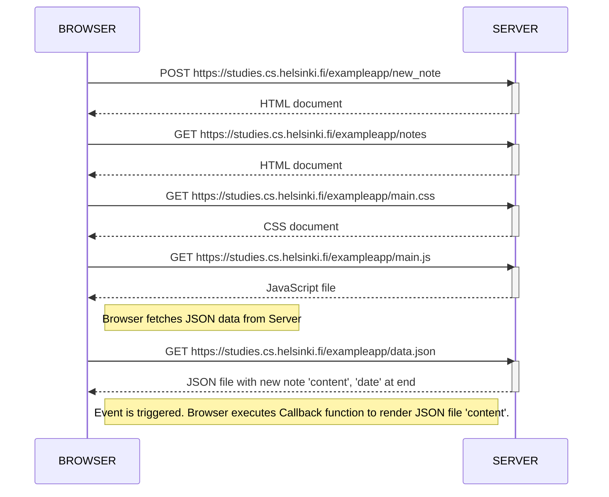

```mermaid
sequenceDiagram
    participant BROWSER
    participant SERVER

    BROWSER->>SERVER: POST https://studies.cs.helsinki.fi/exampleapp/new_note
    activate SERVER
    SERVER-->>BROWSER: HTML document
    deactivate SERVER

    BROWSER->>SERVER: GET https://studies.cs.helsinki.fi/exampleapp/notes
    activate SERVER
    SERVER-->>BROWSER: HTML document
    deactivate SERVER

    BROWSER->>SERVER: GET https://studies.cs.helsinki.fi/exampleapp/main.css
    activate SERVER
    SERVER-->>BROWSER: CSS document
    deactivate SERVER

    BROWSER->>SERVER: GET https://studies.cs.helsinki.fi/exampleapp/main.js
    activate SERVER
    SERVER-->>BROWSER: JavaScript file
    deactivate SERVER

    Note right of BROWSER: Browser fetches JSON data from Server

    BROWSER->>SERVER: GET https://studies.cs.helsinki.fi/exampleapp/data.json
    activate SERVER
    SERVER-->>BROWSER: JSON file with new note 'content', 'date' at end
    deactivate SERVER

    Note right of BROWSER: Event is triggered. Browser executes Callback function to render JSON file 'content'.
```